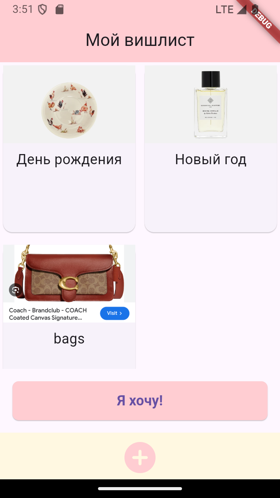

# итоговый проект

# WishList

## Описание
Приложение позволяет пользователю создавать, просматривать созданные им вишлисты
Управление состоянием реализовано с использованием **Provider**.

## Использованные виджеты
- `TextField` для ввода названия и текста хотелки
- `ListView.builder` для отображения списка хотелок
- `Card` для стилизации отдельных хотелок и категорий
- `IconButton` для реализации кнопок создания новых категорий и хотелок
- `ElevatedButton` для кнопки "сохранить"
- `TextFormField` позволяет заполнять формы

## Описание интерфейса
### 
 

