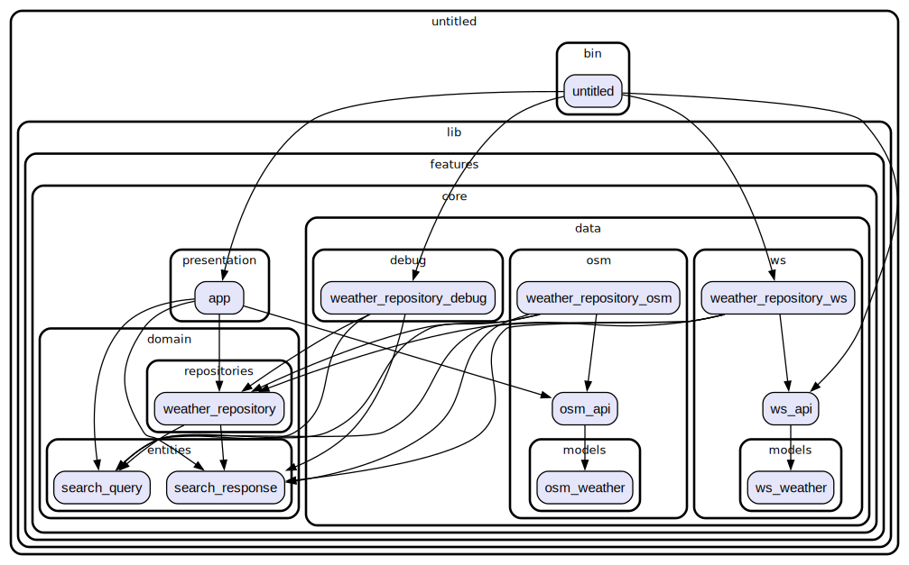

# Weatherstack API

С помощью Weatherstack API был реализован фукнционал отображения погоды
- по городу
- координатам
- [Weatherstack API](https://weatherstack.com/dashboard)

- [PlDb]: <https://github.com/joemccann/dillinger/tree/master/plugins/dropbox/README.md>